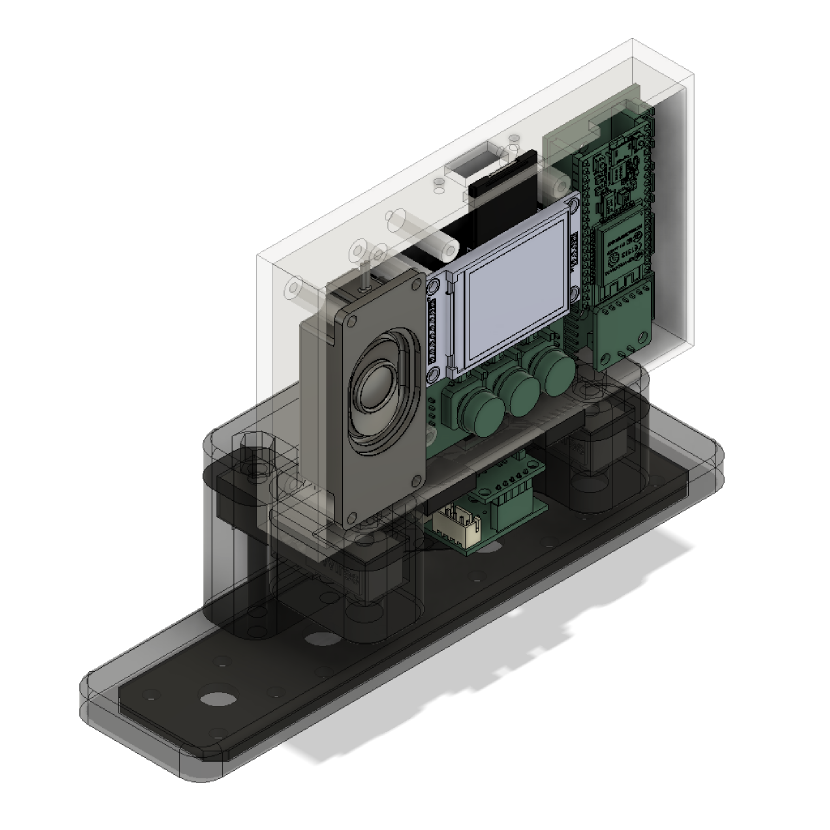

# CAD
I am using Autodesk Fusion 360 as the main CAD software.
In this folder you can find the .f3z file, which contains all the .f3d Fusion 360 3D design files. I chose to upload the f3z file instead of a bundle of STEP files as it holds the complete design and it's way easier to update.

NOTE Install Autodesk Fusion 360, then import everything by following the steps:

1. create a new project by clicking ‘New Project’ in the left toolbar
1. open the new project by double clicking its name
1. upload the .f3d archive from GitHub ([CAD](CAD)) by clicking ‘Upload’ in the left toolbar
1. wait a few minutes, this is uploading multiple designs to your Fusion 360 project
1. open the main assembly (PSH Portable Smart Hangboard May 2024) by double clicking its name. It should look something like this

