# How to build your own PSH Portable Smart Hangboard

## Order the 3 custom PCBs
NOTE At the moment the custom PCB for the MainControllerNodeMCU-32S module needs a small improvement. Currently it's missing a 4-pin connection for interfacing with the SD card on the TFT display. You can either modify the project and add the connector on the PCB (before placing the order), or make the 4 connections manually (solder the 4 wires directly on the PCB, picture found below). Follow the issue on GitHub for updates: [\[PCB\] Update Custom PCB for MainControllerNodeMCU-32S #8](https://github.com/ovidiurosu90/psh-portable-smart-hangboard/issues/8)

NOTE Install KiCad 8.0, and for each of the 3 modules (MainControllerNodeMCU-32S, ScaleModule and SwitchesModule) follow the steps:

1. Open folder as a project (File > Open Project...)
1. Open PCB Editor
1. Generate Gerber & Drill files by following the notes from [KiCad/README.md](KiCad/README.md)
1. Archive all the generated files into a .zip file
1. Upload the .zip file to your PCB manufacturer
1. Place the order for your PCB manufacturer

NOTE When they arrive, they should look like this:

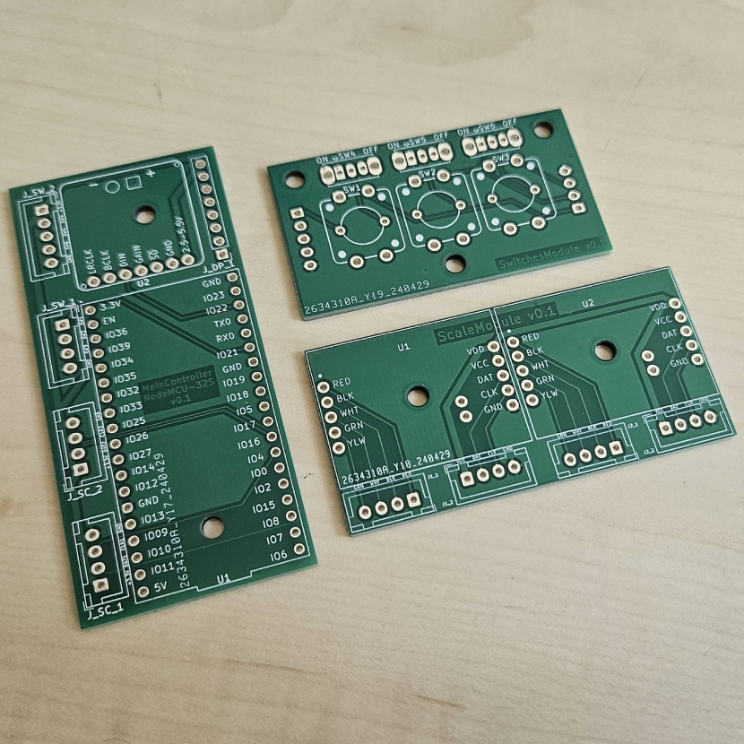

## Procure the components
Check the Bill Of Materials ([BOM.md](BOM.md)), and order the components listed there.

## Crimp the relevant JST-XH connectors

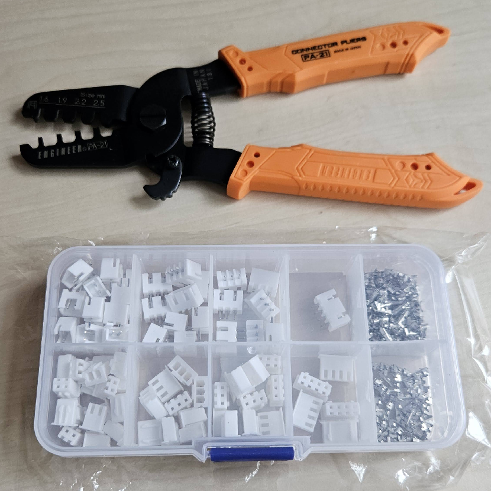

1. Crimp one JST-XH 4-pin female headers to each of the two load cells. Mine ([50 Kg Micro Load Cell](https://eu.robotshop.com/products/micro-load-cell-50-kg?variant=42601477177512)) came with small dupont male 4-pin headers crimped to super thin wires, which I replaced with the JST-XH headers.

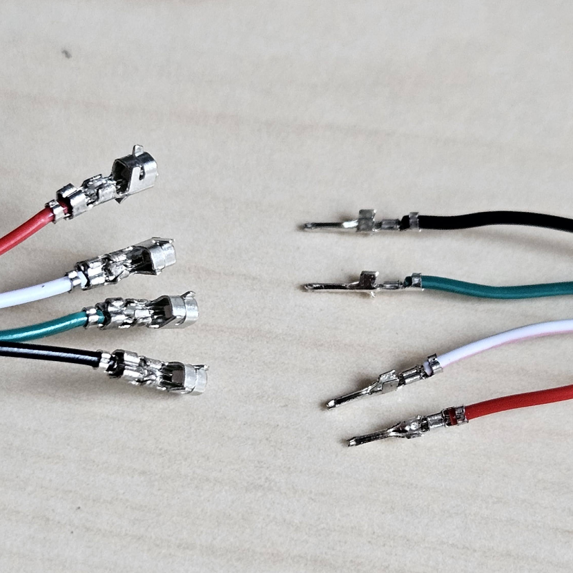

NOTE [Verify the wires](https://circuitjournal.com/four-wire-load-cell-with-HX711) of the load cells with a multimeter, and measure the resistance between all possible pairs. Identify the 2 pairs with the highest resistance, in my case that's 1 k ohm (red-black & white-green), while all the other combinations have a resistance of 750 ohm. This will help you identify the correct configuration in order to connect them to the [SparkFun HX711 Load Cell Amplifier](https://eu.robotshop.com/products/hx711-load-cell-amplifier?variant=42600661942440).

1. Build the wires for the connections between different components (we use 4-pin JST-XH headers)
    1. 2x 4-wire 38cm for ScaleModule
    2. 3x 4-wire 22cm for SmartBox

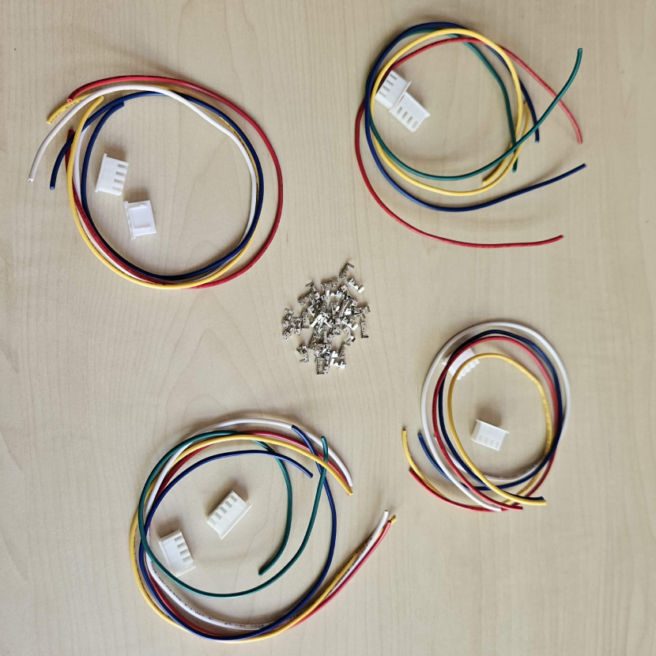

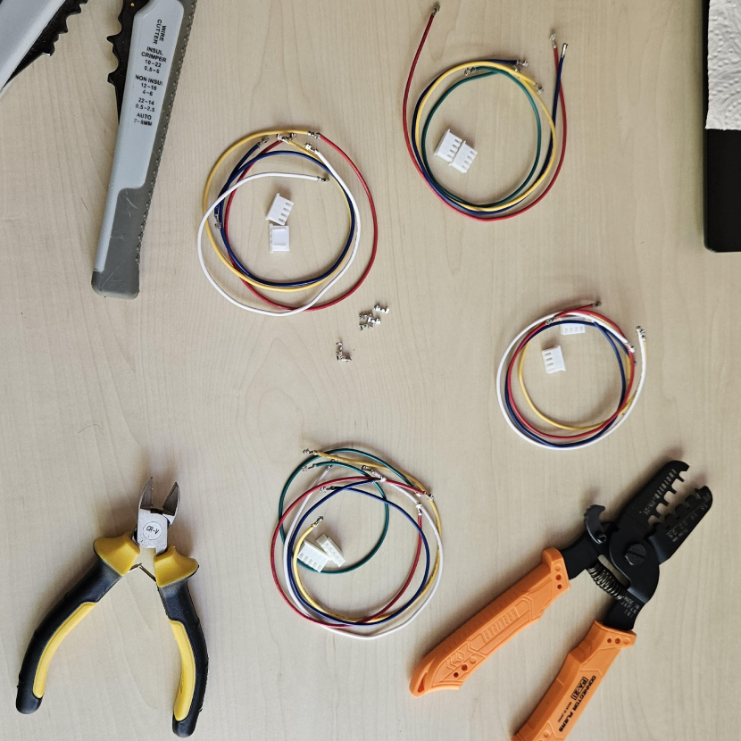

NOTE Check the order of the wires for both ends of the wires. They should match with the order on the PCBs (use the labels on the silkscreen on the PCBs). Below you can see one of them:

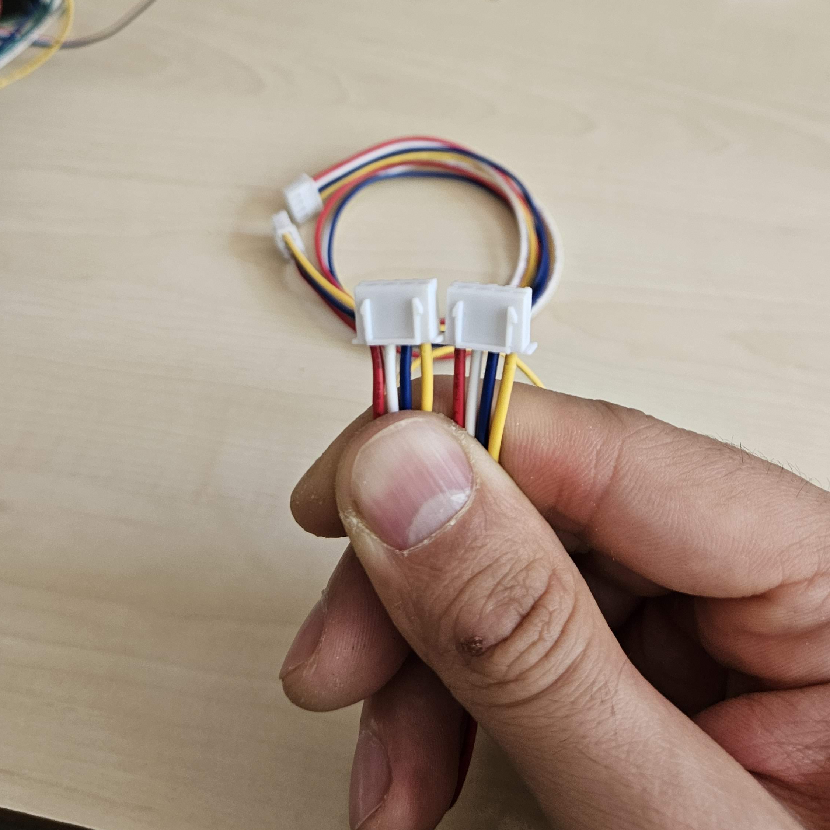

## Solder pins to the third-party components

1. Solder 2x 5-pin 2.54mm pitch male headers to each of the two [SparkFun HX711 Load Cell Amplifier](https://eu.robotshop.com/products/hx711-load-cell-amplifier?variant=42600661942440) modules.

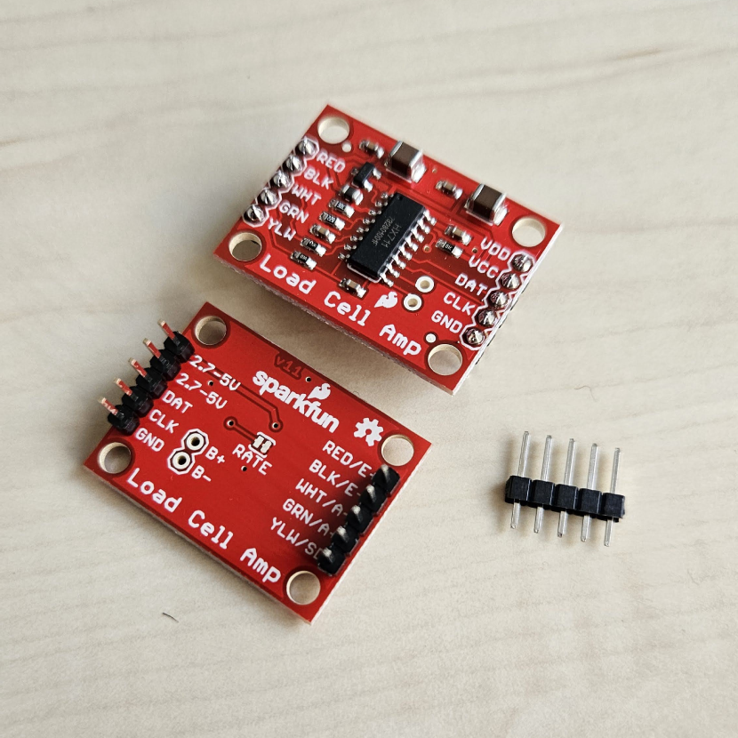

1. Solder a 7-pin 2.54mm pitch male header and a 2-pin screw terminal with 3.5mm pitch to the [SparkFun MAX98357A I2S Audio Breakout](https://opencircuit.shop/product/sparkfun-i2s-audio-breakout-max98357a).

1. Solder a 4-pin 2.54mm pitch male header to the [AZDelivery ST7735 SPI TFT Display 1.8 inch 128 x 160 pixels](https://www.amazon.nl/dp/B078J5TS2G/) for the SD card interface. Mine came with the pins of the TFT display interface already soldered.

## Solder the pin headers and the other components to the custom PCBs

1. Solder the pin headers and the other components to the custom PCBs

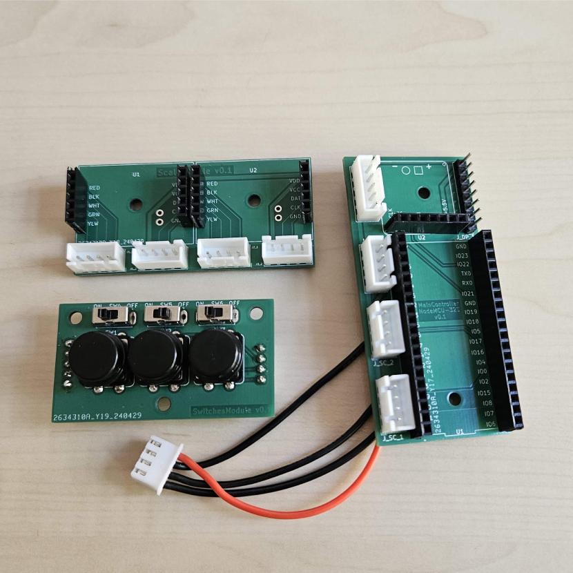

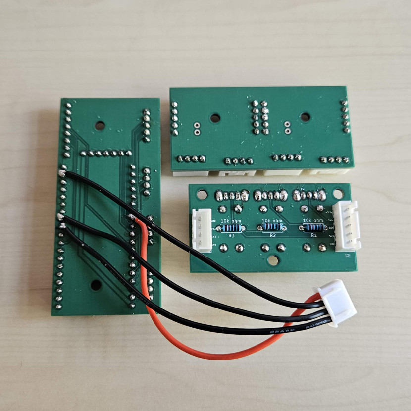

1. TEMP (hopefully) solder the 4-pin JST-XH to the MainControllerNodeMCU-32S

NOTE At the moment the custom PCB for the MainControllerNodeMCU-32S module needs a small improvement. Currently it's missing a 4-pin connection for interfacing with the SD card on the TFT display. You can either modify the project and add the connector on the PCB (before placing the order), or make the 4 connections manually (solder the 4 wires directly on the PCB, picture found below). Follow the issue on GitHub for updates: [\[PCB\] Update Custom PCB for MainControllerNodeMCU-32S #8](https://github.com/ovidiurosu90/psh-portable-smart-hangboard/issues/8)

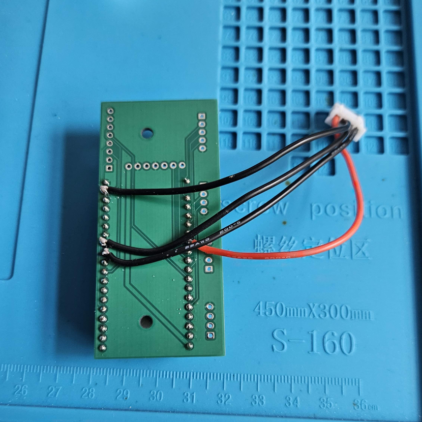

## 3D-print the plastic components

1. Setup your project in Fusion 360 by following the instructions from [CAD/README.md](CAD/README.md)

1. Export the following bodies one by one by right clicking on them > 'Save as Mesh' > OK > Check 'Save to my computer' > 'Save':
- from component 'PSH Scale Assembly May 2024 v4':
  - HangingHoldFlat\_200x50
  - HangingHoldChassis
  - HangingHoldCap
  - MountingHold
  - MountingHoldCap
- from component 'PSH SmartBox Assembly May 2024 v5 / SmartBox':
  - SmartBoxBase
- from component 'ScaleSmartBoxMount':
  - ScaleSmartBoxMount

")

1. Slice the meshes and prepare the .gcode files that will be used by your 3D printer

NOTE I used [PrusaSlicer 2.7](https://www.prusa3d.com/en/page/prusaslicer_424/), though you can use other tools (e.g. [Ultimaker Cura](https://ultimaker.com/software/ultimaker-cura/)).

For each of the exported meshes (from above), follow the steps:
- open PrusaSlicer
- add the mesh by clicking 'Add...' in the top toolbar, then selecting the relevant file (e.g. ScaleSmartBoxMount\_v2\_20240512.3mf)
- select '0.30mm DRAFT' in the right toolbar > 'Print settings'
- select 'Generic PETG' in the right toolbar > 'Filament'
- (optional) add supports for the components that need them
- select '40%' in the right toolbar > 'Infill'
- for advanced settings, go to 'Print Settings' in the top toolbar
  - 0.3mm layer height
  - 0.2mm first layer height
  - vertical shells: 4 perimeters
  - horizontal shells: solid layers 8 top & 8 bottom
- click 'Slice now'
- click 'Export G-code'
- click 'Save'

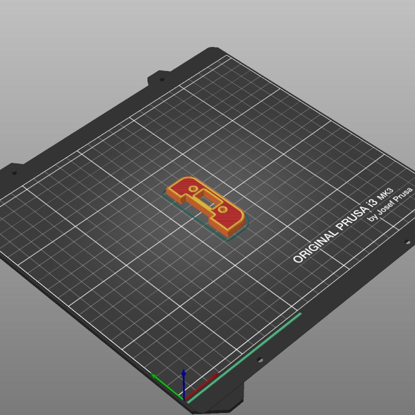

1. 3D-print the components by using the .gcode files generated above

NOTE This step depends on your 3d printer and your setup. I prefer to use [OctoPrint](https://octoprint.org/) for managing the printing jobs, though you can directly send the .gcode files to your 3d printer via USB or SD Card.

## Assemble everything

1. Add the M5 nuts and the flat metal plate to the newly printed components

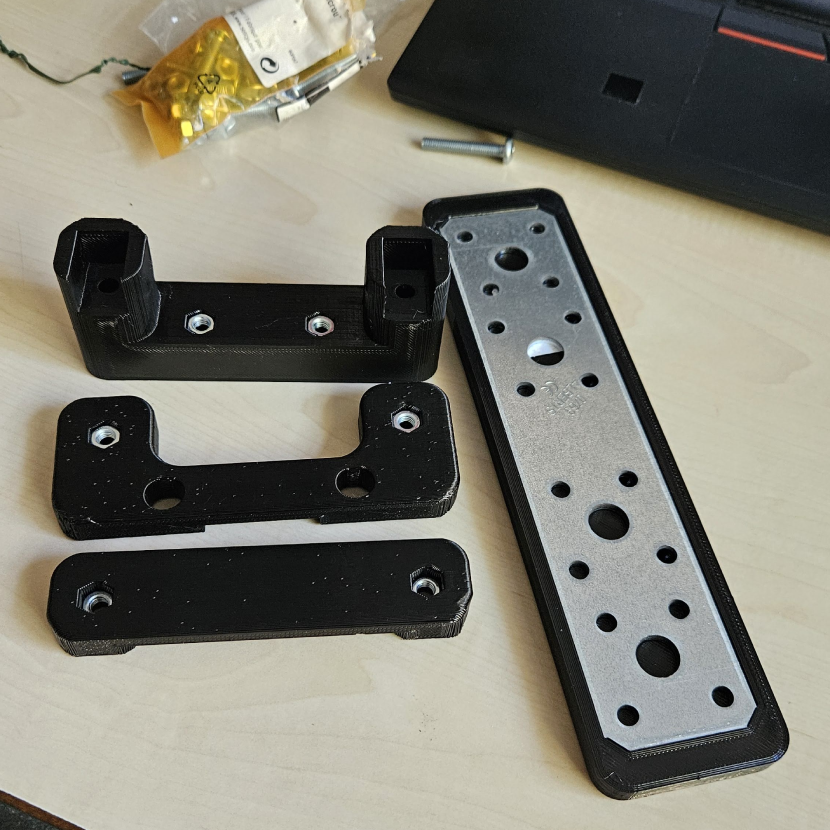

1. Assemble the SmartBox

1. Assemble the Scale

1. Connect the two with the ScaleSmartBoxMount. When done, the full assembly should look like this:

")

")

## Setup the remote API
Follow the instructions from [Web/README.md](Web/README.md) to set up the remote API.

NOTE You will need access to some kind of third party hosting where you can set up and configure a web server.

## Program the main controller
Follow the instructions from [Arduino/README.md](Arduino/README.md) to program the main controller (MainControllerNodeMCU-32S).

## START TRAINING! No More Excuses!

