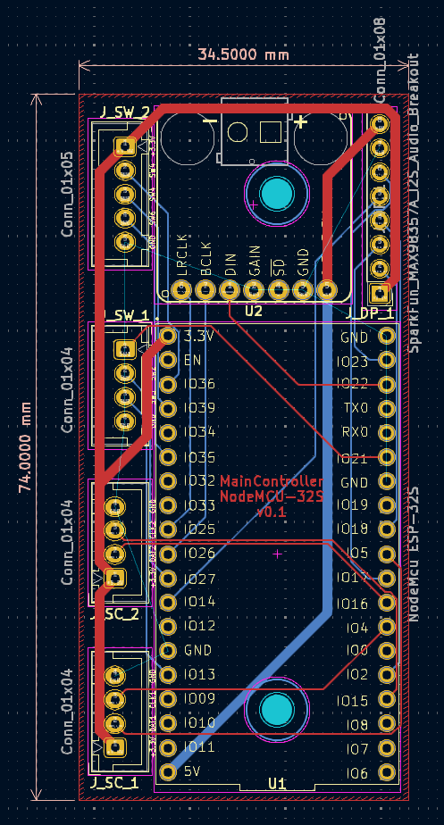
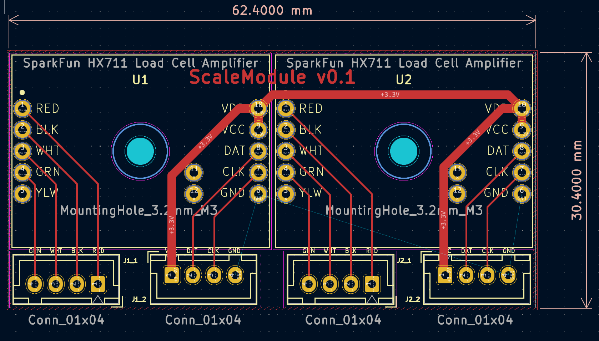
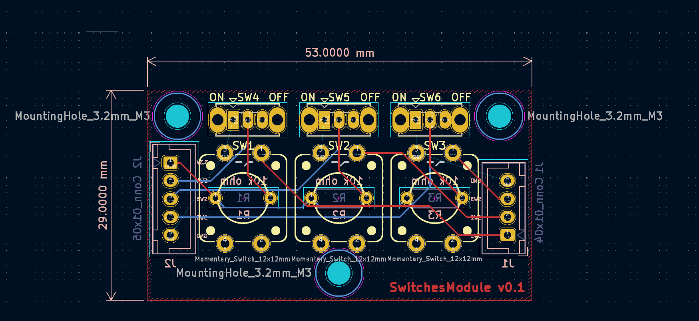

# KiCad
I am using KiCad 8.0 as the main electronics design software. The project at the moment has 3 custom PCBs that were designed with this tool.
You have to send the gerber files to a PCB manufacturer, then solder the connectors / components before assembling.

## Images

## Configuration
### PCB Layers
F.Cu => tracks & maybe name + version
B.Cu => tracks & maybe name + version
F.Adhesive => vias + pads
B.Adhesive => vias + pads
F.Paste => vias + pads
B.Paste => vias + pads
F.Silkscreen => labels front
B.Silkscreen => labels back + pcb dimensions (NOTE in 3D Viewer, you have to make visible Off-board Silkscreen)
F.Mask => pads
B.Mask => pads
User.Comments => mounting holes exterior
Edge.Cuts => pcb edges
F.Courtyard => edges components on the pcb front
B.Courtyard => edges components on the pcb back
F.Fab => references footprints front
B.Fab => references footprints back

### Design Rules -> Constraints
Minimum track width 0.2 mm
Minimum via diameter => 0.7 mm
Minimum through hole => 0.4 mm
Hole to hole clearance => 0.25mm
Minimum uVia diameter => 0.7 mm
Minimum uVia hole => 0.4mm
Minimum text height => 0.5mm

### Design Rules -> Net Classes
- Default
    - Clearance 0.2 mm
    - Track Width 0.2 mm
    - Via Size 0.6 mm
    - Via Hole 0.3 mm
    - uVia Size 0.3 mm
    - uVia Hole 0.1 mm
    - DP Width 0.2
    - DP Gap 0.25 mm
- Custom
    - Clearance 0.3 mm
    - Track Width 0.3 mm
    - Via Size 0.8 mm
    - Via Hole 0.4 mm
    - uVia Size 0.6 mm
    - uVia Hole 0.2 mm
    - DP Width 0.2
    - DP Gap 0.25 mm
- Power
    - Clearance 0.8 mm
    - Track Width 0.8 mm
    - Via Size 1.2 mm
    - Via Hole 0.6 mm
    - uVia Size 0.6 mm
    - uVia Hole 0.2 mm
    - DP Width 0.2
    - DP Gap 0.25 mm

### Design Rules -> Pre-defined Sizes
- Tracks 1 mm width
- Vias 1.2 mm diameter, 1 mm hole
*Tracks: 1 mm for power, netclass width for everything else*

## Validation
A. Schematic Editor
1. Annotate Schematic => make screenshots
2. Electrical Rules Checker
3. Assign Footprints => make screenshots

B. PCB Editor
0. File -> Board Setup -> Import Settings from Another Board...
1. Check F.Cu with unfill zones => make screenshots
2. Check B.Cu with unfill zones => make screenshots
3. Check F.Cu with fill zones => make screenshots
4. Check B.Cu with fill zones => make screenshots
5. Check 3D Viewer front (toggle Through-hole Models on & off) => make screenshots
6. Check 3D Viewer back (toggle Through-hole Models on & off) => make screenshots

7. Check the connections
8. Check order & orientation of the pins for the connectors (e.g. JST-XH)
9. Check pcb size
10. Check version on both F.Cu / B.Cu & page print

11. Update PCB From Schematic (uncheck Delete footprints with no symbols)
12. Design Rules Checker

## Generate Gerber & Drill files
Check [wiki from JLCPCB](https://jlcpcb.com/help/article/362-how-to-generate-gerber-and-drill-files-in-kicad-7)

1. In PCB Editor => File => Fabrication Outputs => Gerbers
2. Select Output directory: Outputs
3. Include Layers
    * F.Cu
    * B.Cu
    * F.Paste
    * B.Paste
    * F.Silkscreen
    * B.Silkscreen
    * F.Mask
    * B.Mask
    * Edge.Cuts
4. Check Plot reference designators
5. Check Check zone files before plotting
6. Check Use Protel filename extensions
7. Check Subtract soldermask from silkscreen

8. Click Plot

9. Click Generate Drill Files
10. Check Use alternate drill mode
11. Check Absolute for Drill Origin
12. Check Milimeters for Drill Units
13. Check Decimal format for Zeros Format

14. Click Generate Drill File
15. Click Generate Map File

## Verify generated Gerber files
* Open Gerber Viewer in KiCad
* File -> Open Excellon Drill File (do it once for each drill file you have)
* File -> Open Gerber Plot File => Edge_Cuts
* File -> Open Gerber Plot File => F_Silkscreen
* File -> Open Gerber Plot File => F_Mask
* File -> Open Gerber Plot File => F_Cu
* File -> Open Gerber Plot File => B_Silkscreen
* File -> Open Gerber Plot File => B_Mask
* File -> Open Gerber Plot File => B_Cu

* Create a zip file from all the files in the Outputs directory & add the version & date to the name (e.g. *MainControllerNodeMCU-32S-v0.1-20240428.zip*)

## Add the zip to your PCB manufacturer (e.g.)
* Go to https://cart.jlcpcb.com/quote
* Check dimensions (auto-generated)
* Check version (on the PCB)
* Select black or white (if it's not too expensive or slow)
* Check mounting holes

* IMPORTANT Check if you want to create or update another board, to save on transport

