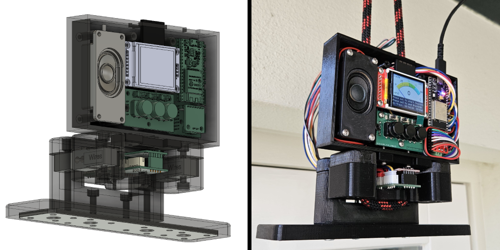
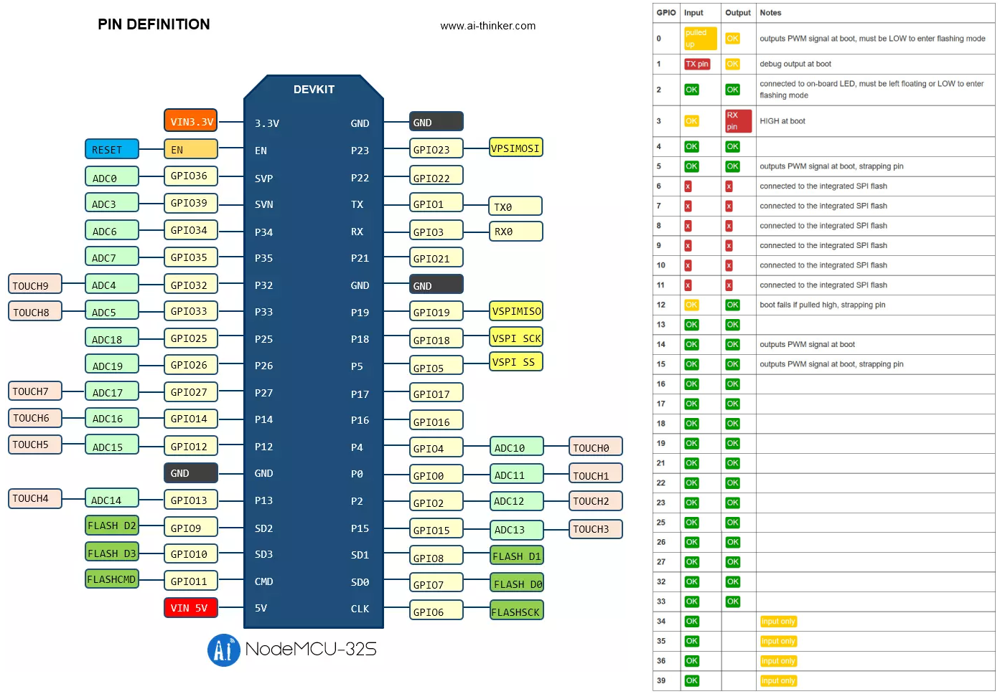
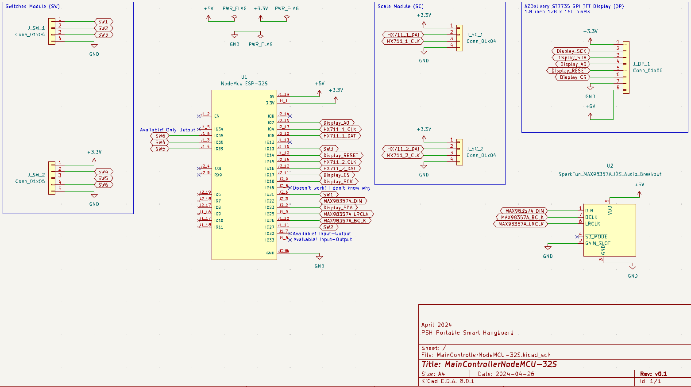

# [PSH Portable Smart Hangboard](https://github.com/ovidiurosu90/psh-portable-smart-hangboard)

## Abstract
### Problem
Help people get better at climbing by improving their finger strength

### Solution
Provide a portable smart hangboard to use for finger strength training

### How
- the whole project is open-source, and can be replicated by interested parties (note it requires a variety of skills like setting up a web server, 3d printing, soldering & crimping)
- the hangboard measures the pressure applied to the hanghold by using a couple of load cells
- the training plans are set in Google Sheets

## Important Links

| Name | README |
| --------------------- | ------------- |
| BOM Bill Of Materials | [BOM.md](BOM.md) |
| How To Build | [HOWTOBUILD.md](HOWTOBUILD.md) |

## Images

## Functionality of switches
- There are 3 big black momentary switches (labeled SW1, SW2 and SW3)
- There are 3 small toggle switches (labeled SW4, SW5 and SW6)
- The functionality of the switches is described below

### SW1
If SW4 is toggled ON: start training

Else: decrease volume

### SW2
If SW4 is toggled ON: start calibrating

Else: store volume into NVS (only if SW5 is toggled ON)

### SW3
If SW4 is toggled ON: end training

Else: increase volume

### SW4
If toggled ON: show train menu

Else: show volume menu

### SW5
If toggled ON: allow NVS to be updated (for calibration and for volume)

Else: don't allow NVS to be updated

### SW6
Not used at the moment

## Usage
- Power the microcontroller via its micro-USB port (+5V)
- Wait for the microcontroller to finish setting things up (it's ready when it says 'idle' on the lower left side of analog meter)
- Configure the training parameters in the spreadsheet via Goole Sheets
- The training program starts with a rest cycle, followed by an activity cycle, then repeat
- Example

| totalCycles | activityTotalSeconds | restTotalSeconds | scaleLowerLimitGrams | scaleUpperLimitGrams |
| ----------- | -------------------- | ---------------- | -------------------- | -------------------- |
| 6           | 10                   | 20               | 55000                | 90000                |

- For the example above, we'll have 6 cycles as follows:
    - cycle 1: rest for 20 seconds
    - cycle 2: activity for 10 seconds
    - cycle 3: rest for 20 seconds
    - cycle 4: activity for 10 seconds
    - cycle 5: rest for 20 seconds
    - cycle 6: activity for 10 seconds

- Start the training by pressing SW1 (note SW4 should be toggled ON)
- The score is updated only in the activity cycles (cycle 2, 4 and 6 in the example above)
- The score is calculated as follows:
    - each second there are 2 scale measurements
    - let's say we have 3 activity cycles of 10 seconds
    - which means 3x 10x 2 measurements
    - we just sum up the 60 measurements (in kg)
- For the exapmle above, the score can be the following:
    - score: 2017 (which is a sum of all the scale measurements)
    - history: 73,70,70,68,71,70,70,70,69,70,62,65,67,68,66,66,66,67,64,64,68,66,67,67,67,65,66,67,65,63
- In the future, the scoring method may be different, as at the moment, we don't penalize out-of-bounds measurements, and we don't reward in-bounds measurements

## Wiring

| [NodeMcu ESP-32S Lua ESP-WROOM-32](https://opencircuit.shop/product/nodemcu-esp-32s-lua-esp-wroom-32-wifi) | [SparkFun HX711 Load Cell Amplifier](https://eu.robotshop.com/products/hx711-load-cell-amplifier?variant=42600661942440) => NOTE we need to solder male pins |
| ---------------------------------------------------------------------------------------------------------- | ------------------------------------------------------------------------------------------------------------------------------------------------------------ |
| 5, 4                                                                                                       | DAT1, CLK1                                                                                                                                                   |
| 16, 15                                                                                                     | DAT2, CLK2                                                                                                                                                   |
| +3.3V                                                                                                      | VDD, VCC                                                                                                                                                     |
| GND                                                                                                        | GND                                                                                                                                                          |

| [NodeMcu ESP-32S Lua ESP-WROOM-32](https://opencircuit.shop/product/nodemcu-esp-32s-lua-esp-wroom-32-wifi) | [AZDelivery ST7735 SPI TFT Display 1.8 inch 128 x 160 pixels](https://www.amazon.nl/dp/B078J5TS2G/ref=pe_28126711_487805961_TE_item?th=1) =>  [guide](https://www.az-delivery.de/en/blogs/azdelivery-blog-fur-arduino-und-raspberry-pi/1-8-toll-tft-am-esp-32-dev-kit-c-betreiben) |
| ---------------------------------------------------------------------------------------------------------- | ---------------------------------------------------------------------------------------------------------------------------------------------------------------------------------------------------------------------------------------------------------------------------------- |
| +5V                                                                                                        | VCC                                                                                                                                                                                                                                                                                |
| GND                                                                                                        | GND                                                                                                                                                                                                                                                                                |
| G17                                                                                                        | CS                                                                                                                                                                                                                                                                                 |
| G14                                                                                                        | Reset / RST                                                                                                                                                                                                                                                                        |
| G2                                                                                                         | A0 / DC                                                                                                                                                                                                                                                                            |
| G23                                                                                                        | Sda / MOSI                                                                                                                                                                                                                                                                         |
| G18                                                                                                        | Sck / SCLK                                                                                                                                                                                                                                                                         |
| 3.3V                                                                                                       | LED                                                                                                                                                                                                                                                                                |

| [NodeMcu ESP-32S Lua ESP-WROOM-32](https://opencircuit.shop/product/nodemcu-esp-32s-lua-esp-wroom-32-wifi) | [AZDelivery ST7735 SPI TFT Display 1.8 inch 128 x 160 pixels](https://www.amazon.nl/dp/B078J5TS2G/ref=pe_28126711_487805961_TE_item?th=1) => [guide](https://randomnerdtutorials.com/guide-to-1-8-tft-display-with-arduino/) |
| ---------------------------------------------------------------------------------------------------------- | ---------------------------------------------------------------------------------------------------------------------------------------------------------------------------------------------------------------------------- |
| G33                                                                                                        | CS                                                                                                                                                                                                                           |
| G23                                                                                                        | MOSI (shared with display)                                                                                                                                                                                                   |
| G19                                                                                                        | MISO                                                                                                                                                                                                                         |
| G18                                                                                                        | SCK / SCLK (shared with display                                                                                                                                                                                              |

NOTE At the moment the custom PCB for the MainControllerNodeMCU-32S module needs a small improvement. Currently it’s missing a 4-pin connection for interfacing with the SD card on the TFT display. You can either modify the project and add the connector on the PCB (before placing the order), or make the 4 connections manually (solder the 4 wires directly on the PCB, picture found below). Follow the issue on GitHub for updates: [\[PCB\] Update Custom PCB for MainControllerNodeMCU-32S #8](https://github.com/ovidiurosu90/psh-portable-smart-hangboard/issues/8).

| [NodeMcu ESP-32S Lua ESP-WROOM-32](https://opencircuit.shop/product/nodemcu-esp-32s-lua-esp-wroom-32-wifi) | [SparkFun MAX98357A I2S Audio Breakout](https://opencircuit.shop/product/sparkfun-i2s-audio-breakout-max98357a) => [guide](https://learn.sparkfun.com/tutorials/i2s-audio-breakout-hookup-guide/all) |
| ---------------------------------------------------------------------------------------------------------- | ---------------------------------------------------------------------------------------------------------------------------------------------------------------------------------------------------- |
| +5V (if we use +3.3V the volume fluctuates)                                                                | VDD                                                                                                                                                                                                  |
| GND                                                                                                        | GND                                                                                                                                                                                                  |
| \-                                                                                                         | SD                                                                                                                                                                                                   |
| GND                                                                                                        | GAIN (+12dB, without this it will be +9dB)                                                                                                                                                           |
| G22                                                                                                        | DIN / DOUT                                                                                                                                                                                           |
| G26                                                                                                        | BCLK                                                                                                                                                                                                 |
| G25                                                                                                        | LRCLK                                                                                                                                                                                                |

| [NodeMcu ESP-32S Lua ESP-WROOM-32](https://opencircuit.shop/product/nodemcu-esp-32s-lua-esp-wroom-32-wifi) | SwitchesModule (my custom PCB) |
| ---------------------------------------------------------------------------------------------------------- | ------------------------------ |
| G21                                                                                                        | SW1                            |
| G27                                                                                                        | SW2                            |
| G13                                                                                                        | SW3                            |
| GND                                                                                                        | GND                            |
| +3.3V                                                                                                      | ~ pull-up resistors            |
| G36                                                                                                        | SW4 with 10k resistor to +3.3V |
| G39                                                                                                        | SW5 with 10k resistor to +3.3V |
| G35                                                                                                        | SW6 with 10k resistor to +3.3V |
| GND                                                                                                        | GND                            |

| [NodeMcu ESP-32S Lua ESP-WROOM-32](https://opencircuit.shop/product/nodemcu-esp-32s-lua-esp-wroom-32-wifi) | ?         |
| ---------------------------------------------------------------------------------------------------------- | --------- |
| G32 (input-output pin)                                                                                     | Available |
| G34 (only output pin)                                                                                      | Available |

